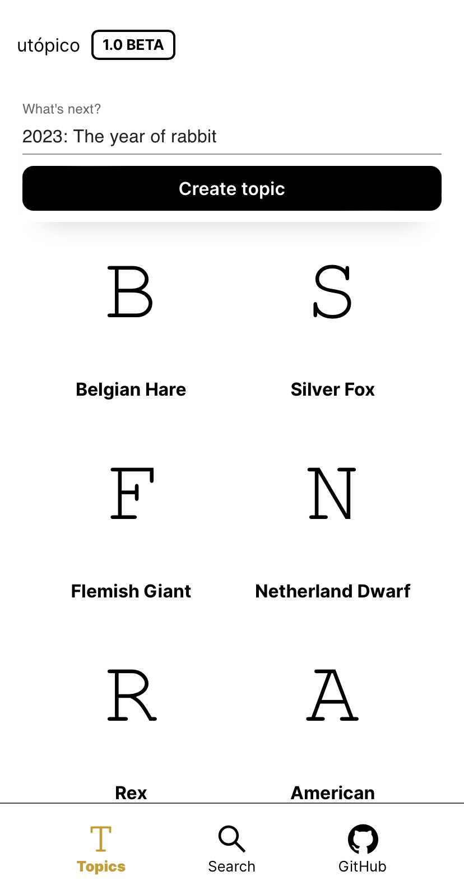

<p align="center">
  

  
  
  <a href="https://github.com/f7lipe/project-utopico/commits/master">
    
  </a>
    
   
   <a href="https://github.com/tgmarinho/f7lipe/project-utopico/stargazers">
    
  </a> 
</p>
<h1 align="center">
    
</h1>

<strong>Português 🇧🇷</strong>
<br>
[English 🇺🇸](./README-en.md) 

<h4 align="center"> 
	🚧 Utópico - [ projeto em construção ] 🚧
</h4>

<p align="center">
 <a href="#-sobre-o-projeto">Sobre</a> •
 <a href="#-funcionalidades">Funcionalidades</a> •
 <a href="#-layout">Layout</a> • 
 <a href="#-como-executar-o-projeto">Como executar</a> • 
 <a href="#-tecnologias">Tecnologias</a> • 
 <a href="#-autor">Autor</a> • 
 <a href="#user-content--licença">Licença</a>
</p>


## 💻 Sobre o projeto

Utópico é um aplicativo web moderno, elegante e incrivelmente fácil de usar que permite a criação e gerenciamento de assuntos. Perfeito para esquematizar ideias, notas pessoais e tópicos de provas e concursos. 

---

## ⚙️ Funcionalidades

   Os usuários tem acesso ao aplicativo web ( responsividade móvel e dekstop ), onde podem:
  - [x] criar, editar, arquivar/desarquivar e apagar tópicos 
  - [x] navegar pelos tópicos criados 
  - [ ] visualizar tags de marcação de um tópico como títulos, citações, parágrafos, códigos, imagens, etc...
  - [ ] relacionar tópicos
  - [ ] pesquisar tópicos por título, relação ou data de modificação 
  - [ ] arrastar e soltar tópicos para combinar ou relacionar 

---

## 🎨 Layout

O layout da aplicação está disponível no Figma:

<a href="https://www.figma.com/file/1SxgOMojOB2zYT0Mdk28lB/Ecoleta?node-id=136%3A546">
  
</a>


### Mobile

<p align="center">
  

  
</p>

### Desktop

<p align="center" style="display: flex; align-items: flex-start; justify-content: center;">
  

  
</p>

---

## 🚀 Como executar o projeto

Este projeto é divido em duas partes:
1. Backend (pasta server) << disponível em breve >>
2. Frontend (pasta front)

⚠️ O Frontend necessita que o Backend esteja sendo executado para funcionar. Enquanto o Backend não está disponível no repositório, uma mock API pode ser utilizada. Você pode utilizar o conteúdo de ``` https://639a7d283a5fbccb5268037a.mockapi.io  ```. 

### Pré-requisitos

Antes de começar, você vai precisar ter instalado em sua máquina as seguintes ferramentas:
[Git](https://git-scm.com), [Node.js](https://nodejs.org/en/). 
Além disto é bom ter um editor para trabalhar com o código como [VSCode](https://code.visualstudio.com/)

#### 🎲 Rodando o Backend [ em breve ]


#### 🧭 Rodando a aplicação web (Frontend)

```bash

# Clone este repositório
$ git clone git@github.com:f7lipe/project-utopico

# Acesse a pasta do projeto no seu terminal/cmd
$ cd project-utopico

# Vá para a pasta da aplicação Front End
$ cd frontend

# Instale as dependências
$ npm install

# crie uma variável de ambiente
$  touch .env 

# no arquivo .env criado adicione uma variável de ambiente com  a url da API 
$  nano .env 

API_URL = "https://639a7d283a5fbccb5268037a.mockapi.io"

# salve a alteração

# Execute a aplicação em modo de desenvolvimento
$ npm run start

# A aplicação será aberta na porta:3000 - acesse http://localhost:3000

```

---

## 🛠 Tecnologias

As seguintes ferramentas foram usadas na construção do projeto:

#### **Website**  ([React](https://reactjs.org/)  +  [TypeScript](https://www.typescriptlang.org/))

-   **[React Router Dom](https://github.com/ReactTraining/react-router/tree/master/packages/react-router-dom)**
-   **[React Icons](https://react-icons.github.io/react-icons/)**
-   **[Axios](https://github.com/axios/axios)**
-   **[Tiptap](https://tiptap.dev)**
-   **[Styled-components](https://styled-components.com/)**

> Veja o arquivo  [package.json](https://github.com/f7lipe/project-utopico/blob/master/front/package.json)

####  **Server (em breve)**  


#### [](https://github.com/tgmarinho/Ecoleta#utilit%C3%A1rios)**Utilitários**

-   Protótipo:  **[Figma](https://www.figma.com/)**  →  **[Protótipo (Utópico)](https://www.figma.com/file/afIgOzHkQDdTvsEokD2lbV/Project-Ut%C3%B3pico?node-id=0%3A1&t=xVvOkXc2JO8UWHuw-1)**
-   Editor:  **[Visual Studio Code](https://code.visualstudio.com/)**  → Extensions:  **[vscode-styled-components](https://marketplace.visualstudio.com/items?itemName=styled-components.vscode-styled-components)**
-   Markdown:  **[StackEdit](https://stackedit.io/)**,  **[Markdown Emoji](https://gist.github.com/rxaviers/7360908)**
-   Teste de API:  **[Thunder Client](https://marketplace.visualstudio.com/items?itemName=rangav.vscode-thunder-client)**
-   Fontes: **[Roboto](https://fonts.google.com/specimen/Roboto)**
---


## 🦸 Autor

<a href="https://github.com/f7lipe">
 
 <br />
 <sub><b>Filipe Correia</b></sub></a>
 <br />

[](https://www.linkedin.com/in/f7lipe/) 
[](mailto:filipe.rcs@icloud.com)
[](https://twitter.com/f7lipe) 

---

## 📝 Licença

Este projeto esta sobe a licença [MIT](./LICENSE).

Feito com ❤️ por Filipe Correia 👋🏽 [Entre em contato!](https://www.linkedin.com/in/f7lipe/)

---
